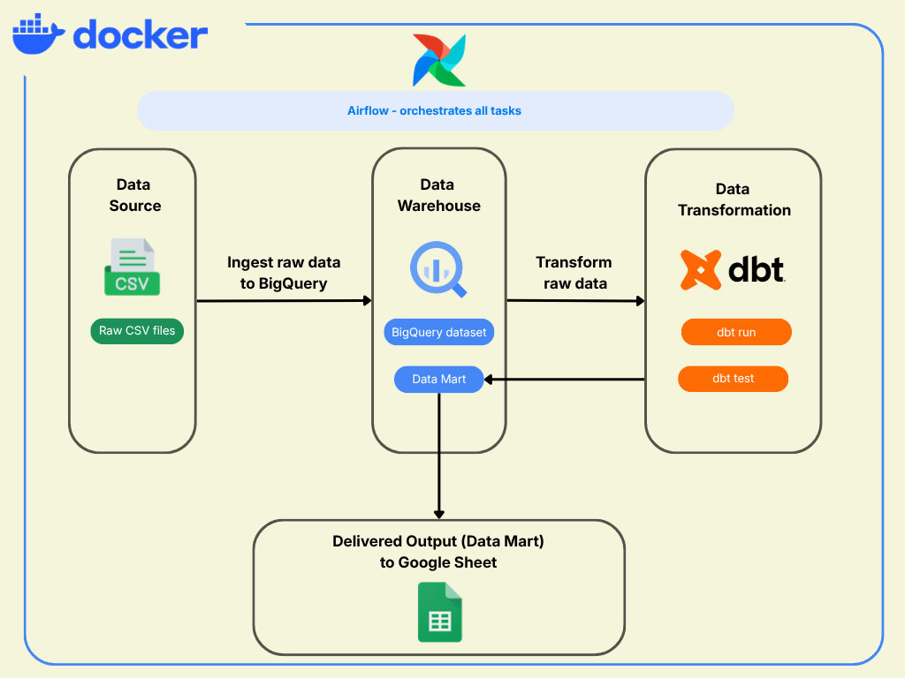
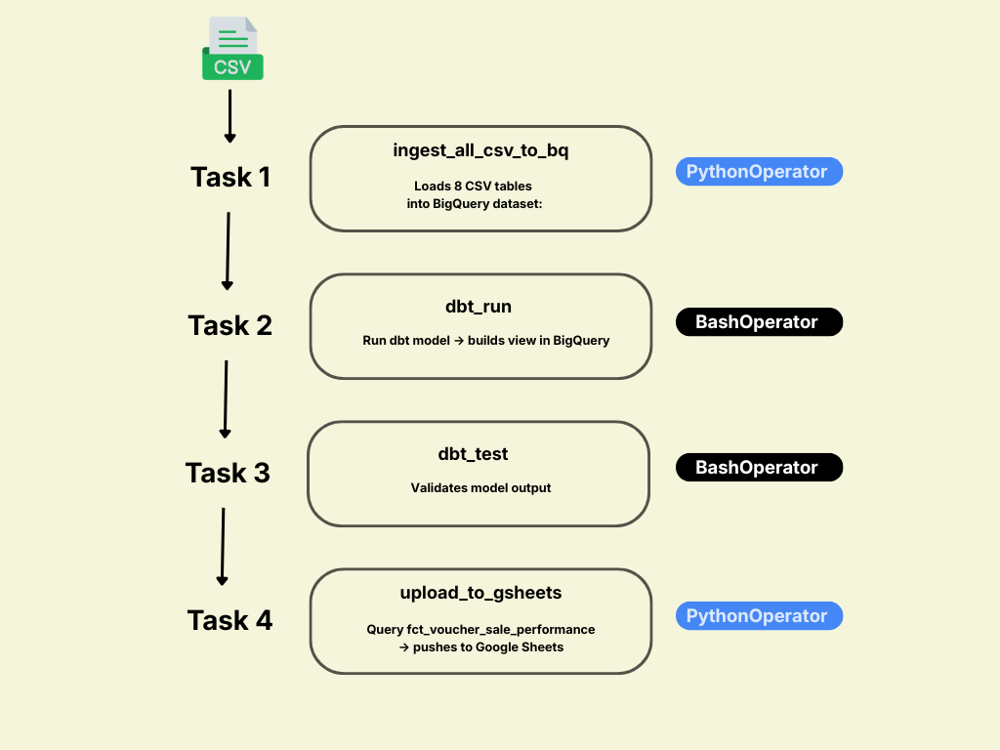
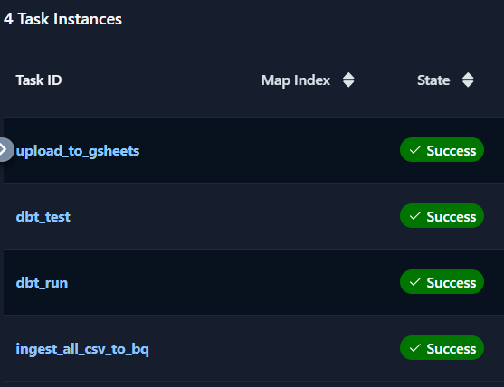
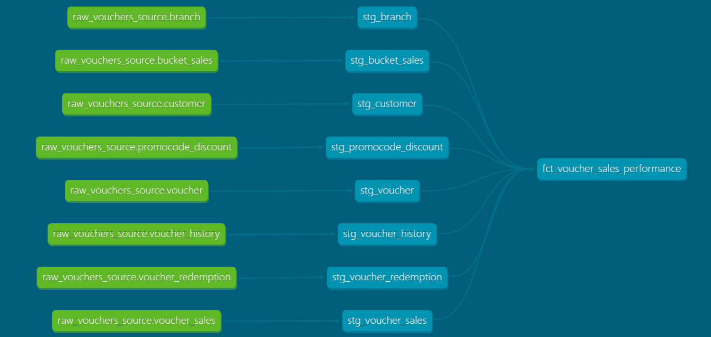

# 🎫 Voucher Analytics Pipeline

An end-to-end analytics engineering project that automated data pipeline to analyze voucher performance. Transforming raw CSV files into actionable insights on Google Sheets. Support the Marketing team in turning data insights into effective marketing strategies.

---

## 📋 Project Requirement

The Marketing team requires daily refreshed data on voucher performance to support campaign planning and decision-making. The Output must be delivered to their workspace in Google Sheets.

---

## 🛠️ Tech Stack

| Layer | Tool | Role |
| --- | --- | --- |
| Infrastructure | Docker | Runs the entire stack consistently on any machine |
| Orchestration | Apache Airflow  | Schedules and manages task execution order |
| Data Warehouse | Google BigQuery | Stores raw tables and transformed models (data mart) |
| Transformation | dbt (dbt-bigquery) | Transforms raw data into data mart models |
| Output | Google Sheets | Delivers final data to the business team |

---

## 🏗️ Pipeline Architecture

The entire system operates within a Docker environment, with Airflow orchestrating every task.



---

## ➡️ How the Pipeline Works

The DAG `vouchers_transformation_pipeline` runs daily and executes 4 tasks in sequence:




---

### 1. Data Ingestion `ingest_all_csv_to_bq()`

**Key Logic:**

- Scan CSV files.
- Use pandas to handle header issue.
- Load data into `raw_vouchers` dataset in BigQuery using `WRITE_TRUNCATE`to delete existing data and replace entirely on every run

```python
df_temp = pd.read_csv(file_path)

job_config = bigquery.LoadJobConfig(write_disposition="WRITE_TRUNCATE")

load_job = client.load_table_from_dataframe(df_temp, table_id, job_config=job_config)
load_job.result()
```

---

### 2. Data Transformation `dbt_run`

```bash
cd /opt/airflow/dbt && dbt run --profiles-dir .
```

dbt reads `profiles.yml` from the same directory (`--profiles-dir .`) to connect to BigQuery

**dbt project config:**

- Project name: `voucher_analytics`
- Connection profile: `voucher_profile`
- BigQuery dataset: `raw_vouchers`
- Region: `asia-southeast1`
- Models materialized as: `view`

Data model logic:

- Integrated multiple required schemas into the data mart layer.
- Data type normalization.
- Calculated sales allocation using CTEs to resolve duplication issues.

---

### 3. Data Validation `dbt_test`

```bash
cd /opt/airflow/dbt && dbt test --profiles-dir .
```

dbt runs all test in `fct_voucher_sales_performance.yml`  file.

Test logic:

- The redemption id must not null and must unique.
- Validates that every `used_transaction_id` in the fact table is a valid transaction
- Every redemption must have voucher code.

---

### 4. Data Delivery  `upload_to_gsheets`

**Key Logic:**

```python
# 3. Query fct model from BigQuery
bq_client = bigquery.Client.from_service_account_json(JSON_PATH)
query = "SELECT * FROM `ae-project-487716.raw_vouchers.fct_voucher_sales_performance`"

# 4. Data Cleaning for spreadsheet
#    - Convert Timestamps → strings
#    - Handle NaN → empty string
#    - Cast int64/float64 → Python native types

# 5. Write data on sheets (clear and then update)
sheet = client.open_by_key(SPREADSHEET_ID).worksheet('voucher_data')
sheet.clear()
sheet.update([header] + data_rows, value_input_option='USER_ENTERED')
```

---

## 🚀 Execution

To initialize and run the entire pipeline, execute the following command in your terminal from the project root:

1. **Build and Start Containers:**PowerShell
    
```bash
docker-compose up -d --build
```
    
    *This command automatically installs all dependencies from `requirements.txt` into Airflow image.*
    
2. **Access Interfaces:**
    - **Airflow UI:** `http://localhost:8080` (Pipeline Management)
        - Trigger DAG: `http://localhost:8080` → Dags → vouchers_transformation_pipeline → Trigger.
        
            

    - **dbt Documentation:** `http://localhost:8081` (Data Lineage & Catalog)
    
    
    

## 📊 Output

Processed data is automatically pushed to Google Sheets daily based on the defined schedule.

- **Google Sheet Link:** [https://docs.google.com/spreadsheets/d/1RJ5LWA3hi0MFIMhfRIZONeTQ0qTvjDAPqUdRr3kOKKA/edit?usp=sharing](https://docs.google.com/spreadsheets/d/1RJ5LWA3hi0MFIMhfRIZONeTQ0qTvjDAPqUdRr3kOKKA/edit?usp=sharing)

---